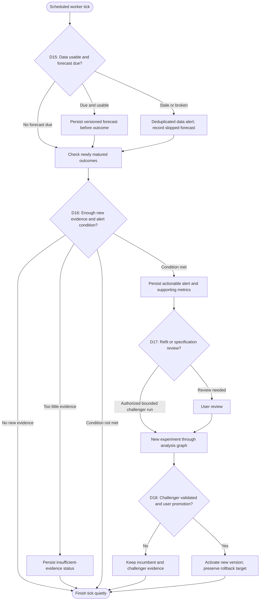

# Agent Workflow and Decision Contracts

Status: proposed design, 2026-09-08. This graph is not an implemented LangGraph.
Rule identifiers correspond to the draft [decision policy](../config/decision_policy.toml).

## Responsibilities

LangGraph executes the state machine. The policy engine evaluates numerical and
eligibility rules. Gemini interprets intent and proposes catalog choices and
recommendations. Langfuse records the execution, prompts, tool calls, and linked
evidence. Local immutable decision records remain the audit source if telemetry
is temporarily unavailable.

Explicit decisions mean inputs, constraints, alternatives, evidence, applied
rules, outcome, and a concise explanation. They do not require storing a model's
private internal reasoning. The graph describes allowed paths; a trace describes
one actual execution. Branching creates experiment lineage, not an unbounded
autonomous agent tree.

## Analysis graph

```mermaid
flowchart TD
    START([Conversation or experiment branch]) --> D01{D01: Request complete?}
    D01 -->|No| ASK[User interrupt: missing fields]
    ASK --> D01
    D01 -->|Yes| CATALOG[Resolve target and catalog candidates]
    CATALOG --> D02[D02: User candidate and pin review]
    D02 --> D03{D03: Feasible scope and budget?}
    D03 -->|No| RESCOPE[User interrupt: revise scope or budget]
    RESCOPE --> D02
    D03 -->|Yes| SNAPSHOT[Snapshot data and release metadata]
    SNAPSHOT --> D04{D04: Usable data and timing?}
    D04 -->|Repairable| REPAIR[Bounded data repair or source choice]
    REPAIR --> SNAPSHOT
    D04 -->|Unsupported| STOP([Blocked or historical-only result])
    D04 -->|Usable or labeled exploratory| D05[D05: Freeze specification, routing, splits and policy]
    D05 --> FOLD[Candidate and development origin: training data only]
    FOLD --> D06{D06: Integration evidence?}
    D06 -->|Stationary specification| D20[D20: Preserve or transform; record pre/post evidence]
    D06 -->|Eligible I1 level relation| D07{D07: Cointegration evidence?}
    D07 -->|Supported and timing valid| ECM[Build linear ECM]
    D07 -->|Not supported| D20
    D06 -->|Mixed orders with supported transforms| D20
    D06 -->|I2 or inconclusive without supported route| SKIP[Record ineligible candidate-origin]
    D20 --> TRANSFORM_OK{Supported stationary recipe?}
    TRANSFORM_OK -->|No| SKIP
    TRANSFORM_OK -->|Yes| D19[D19: Observable lag recipes and training-only selection]
    ECM -->|Preserve long-run levels; transform short-run terms| D20
    D19 --> LINEAR[Build allowed linear or ECM short-run terms]
    LINEAR --> D08{D08: Seasonal evidence and family permission?}
    D08 -->|No or already adjusted| BASE[Preserve base specification]
    D08 -->|Supported linear seasonal variant| FOURIER[Add bounded Fourier terms]
    D08 -->|Seasonal difference requires a new recipe| RECIPE[New predeclared variant via D20; bounded job]
    RECIPE --> D20
    D08 -->|Approved decomposition variant| STL[Training-only STL; explicit forecast and reseasonalization]
    BASE --> D09{D09: Fit and forecast valid?}
    FOURIER --> D09
    STL --> D09
    D09 -->|No| SKIP
    D09 -->|Yes| SCORE[Store forecast, baseline, errors and common-scale reconstruction]
    SCORE --> MORE{More candidate-origin jobs?}
    SKIP --> MORE
    MORE -->|Yes| FOLD
    MORE -->|No| D10[D10: Eligibility and Pareto fronts]
    D10 --> EMPTY{Eligible front exists?}
    EMPTY -->|No| NONE([No qualified champion; preserve evidence])
    EMPTY -->|Yes| D11[D11: Detailed diagnostics for every front member]
    D11 --> HARD{New hard exclusions?}
    HARD -->|Yes: recompute finite front| D10
    HARD -->|No| D12[D12: Rule default and Gemini evidence-backed proposal]
    D12 --> D13[D13: Resolve choice and audit untouched holdout once]
    D13 -->|Fails or insufficient evidence| NONE
    D13 -->|Qualified or explicit shadow status| REPORT[Save report, predictions, model and provenance]
    REPORT --> D14{D14: User action?}
    D14 -->|View or export| REPORT
    D14 -->|Change variables or method| BRANCH[New child experiment; mark holdout exposure]
    BRANCH --> D01
    D14 -->|Activate selected model| MONITOR([Monitoring workflow])
```



Training-only loops implement a frozen procedure, not adaptive improvisation after
each validation score. Family permissions, fallback behavior, seasonal periods,
transformations, and budgets are fixed at D05. D06-D09 evaluate only the current
training prefix. A changed procedure needs a new experiment version. D11 is
cached per model/evidence version so front recomputation does not repeat work.

STL descriptive plots may be generated independently of a forecasting branch.
STL forecasting is an optional challenger requiring a complete predictive recipe;
if it lacks a comparable complexity measure it remains in a separate comparison
group. Additional variants are not automatically combined into an unlimited grid.

## Decision register

| ID | Owner | Required evidence and outcome |
| --- | --- | --- |
| D01 | Gemini + schema + user | Resolved target, scale, objective, monthly frequency, one-month horizon, exact/up-to size, pins; interrupt only for missing information |
| D02 | Gemini proposal + user | Catalog IDs, coverage, relevance to `Y`, exclusions and pin constraints; persist user edits and accepted universe |
| D03 | Deterministic policy + user | Combination count including permitted family/lag variants, fit budget, sample feasibility; run, revise, or defer |
| D04 | Data tools + policy | Publication availability, revisions, units, missingness, common calendar, source rights; operational, exploratory, historical-only, or blocked |
| D05 | Policy + user-visible specification | Immutable input snapshots, forecast contract, supported families, transformations, split dates, search scope, routing/policy hash |
| D06 | Statistical tools + policy | ADF/KPSS and visual summaries on training inputs; trend/lag settings; supported integration route or inconclusive status |
| D07 | Statistical tools + policy | Candidate-specific I1 prerequisites, Engle-Granger statistic/p-value/critical values, sample and timing; allow ECM or short-run alternative |
| D08 | Statistical tools + policy | Adjustment metadata, training seasonal evidence, repeated-cycle sufficiency, parameter budget; no extension, Fourier variant, or declared STL variant |
| D09 | Numerical tools + policy | Rank/convergence, residual degrees of freedom, ECM stability where relevant, finite forecast, as-of feature availability; valid or reason-coded failure |
| D10 | Deterministic policy | Comparable origins/scale, complete objective vectors, validity flags, dominance relations; per-group front or empty result |
| D11 | Statistical tools + policy | Tests, plots, assumptions and method-specific validity; warnings or hard exclusion requiring front recomputation |
| D12 | Rule engine + Gemini | Eligible IDs, rule default, metric/diagnostic references, shortlist trade-offs; validated proposal or deterministic fallback |
| D13 | User if choices differ + policy | Frozen chosen model, holdout exposure record, baseline audit; qualified, shadow-only, or no-qualified-champion |
| D14 | User | View/export versus experiment branch versus activation; recorded model ID and status |
| D15 | Worker + data policy | Release calendar, freshness, as-of features; issue forecast or record missing/stale input |
| D16 | Worker + monitor policy | Newly matured prediction IDs, rolling evidence, cooldown state; alert, insufficient evidence, or no action |
| D17 | Policy + Gemini explanation | Alert evidence, candidate refit/specification-change request, compute budget; challenger experiment or review |
| D18 | User + promotion policy | Incumbent/challenger comparison and validation status; promote, retain, or rollback with immutable event |
| D19 | Statistical tools + policy + user constraints | Economic versus publication lag, allowed lag menu, optional lagged target, training-only inner selection or frozen grid, fit count; observable lag specification or infeasible status |
| D20 | Statistical tools + policy | Original integration evidence, log/domain checks, differencing orders, pre/post checks, effective sample, inversion anchors; supported recipe or inconclusive status |

Each statistical branch includes a skipped/inconclusive result. Default alpha 0.05
is a configurable diagnostic convention, not a universal model-quality threshold.
Cointegration is not used to prove causality, and ECM is not forced when integration
orders or publication timing violate its specification.

The ECM node also invokes D20 for its short-run differencing recipe while preserving
the long-run levels. D08 can request a seasonal-difference variant only when that
variant was permitted at D05 and has not already been visited. Every variant has
a stable ID, so this edge cannot loop indefinitely or repeatedly difference data.
D19 may not alter a user-pinned lag silently. Unavailable lag/inversion inputs
route to D09 failure, not future filling. A model family, lag grid, or transformation
recipe introduced after viewing development results creates a new exploratory run.

## Monitoring graph



The operational scheduler belongs to the application, not to the conversation
hosting this planning task. Nothing in this document creates a running monitor.

## State and decision contracts

Proposed graph state stores references rather than large dataframes:

| State group | Fields |
| --- | --- |
| Identity | `session_id`, `experiment_id`, `parent_experiment_id`, `run_id`, `checkpoint_id` |
| Intent | `resolved_request`, `target_spec`, `forecast_origin_policy`, `user_constraints` |
| Search | `catalog_snapshot_id`, `candidate_ids`, `pinned_ids`, `excluded_ids`, `family_permissions`, `budget` |
| Evidence | `data_snapshot_ids`, `feature_spec_id`, `transformation_recipe_ids`, `lag_spec_ids`, `split_manifest_id`, `test_result_ids`, `model_result_ids` |
| Selection | `comparison_group_ids`, `pareto_model_ids`, `rule_default_id`, `llm_proposal_id`, `selected_model_id` |
| Execution | `status`, `pending_question`, `attempt_count`, `decision_ids`, `artifact_ids`, `holdout_exposure` |

Every decision event must include `decision_id`, `rule_id`, `policy_version`,
`experiment_id`, `parent_decision_id`, `actor`, `input_refs`, `candidate_options`,
`evidence_refs`, `selected_option`, `reason_codes`, `explanation`, `timestamp`,
and `execution_status`. LLM decisions also include prompt version, provider/model,
validated structured response, and trace/generation IDs when available. Numerical
decisions include implementation version and relevant settings.

Example event shape (illustrative, not an actual analytical result):

```json
{
  "decision_id": "example-decision-007",
  "rule_id": "D07",
  "policy_version": "0.1.0-draft",
  "experiment_id": "example-experiment",
  "parent_decision_id": "example-decision-006",
  "actor": "statistical_policy",
  "input_refs": ["snapshot:example", "training-window:example"],
  "candidate_options": ["linear_ecm", "stationary_changes", "inconclusive"],
  "evidence_refs": ["integration-report:example", "engle-granger:example", "availability:example"],
  "selected_option": "linear_ecm",
  "reason_codes": ["I1_PREREQUISITES_SUPPORTED", "COINTEGRATION_EVIDENCE", "FEATURES_OBSERVABLE"],
  "explanation": "Training evidence supports evaluating the declared ECM candidate.",
  "timestamp": "2026-09-08T00:00:00Z",
  "execution_status": "illustrative_only"
}
```

## Tracing, failure handling, and reproducibility

Use one Langfuse session for a conversation; correlate execution segments using
experiment/run/checkpoint IDs. Observe graph steps, bounded tool calls, and Gemini
generations. Attach decision IDs, short reasons, settings, evidence summaries,
and artifact references. Track error/latency/cost separately from statistical
quality. Langfuse scores must be named and scoped, such as recommendation-evidence
validity, rather than an ambiguous single "quality" score.

Version prompts with exportable repository copies and record the effective prompt
version/hash used in each run. Pin policy/model/dependency versions. Do not
assume replay produces identical LLM prose; retain accepted proposals verbatim.

Allow at most two structured-response repair attempts and bounded transient
retries. A failed Gemini explanation falls back to an evidence template. Numerical
failure preserves a reason-coded result. No catalog match creates a user choice,
not an invented series. Non-actionable unchanged monitoring ticks stay quiet.

Persist user interrupts and make tool effects idempotent on resume. Checkpointed
execution can repeat node code, so forecast issuance, report export, and alert
creation require stable idempotency keys. A Langfuse outage must not discard local
decisions; queue telemetry for retry and show audit synchronization status.

At implementation time, export the actual LangGraph topology and check that its
decision IDs match this register and policy. Keep model-family subgraphs and
their enable/skip conditions visible in the user-facing experiment view.
