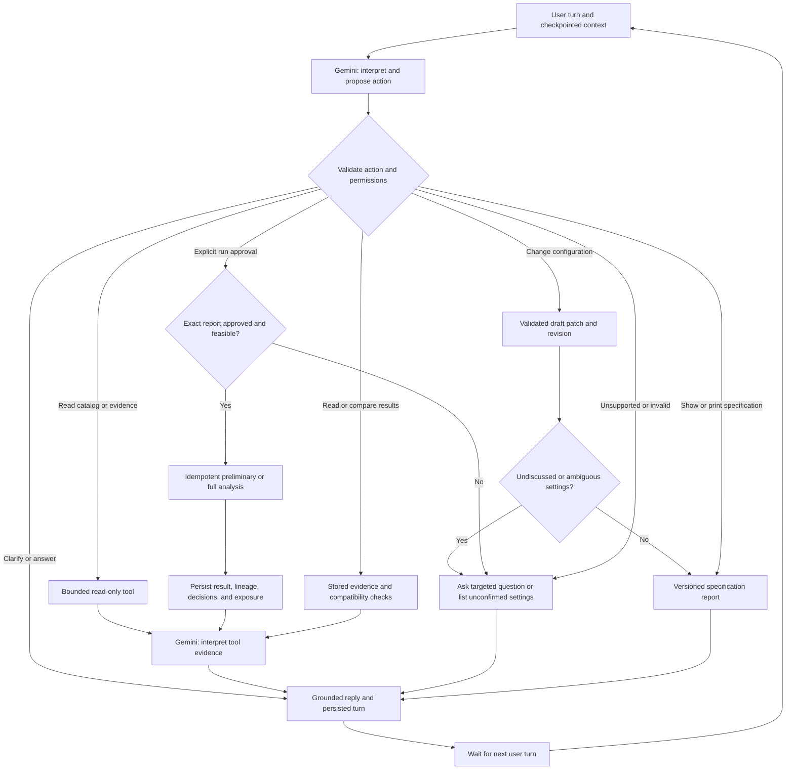

# Manto: Conversational Agent Executive Plan

Version 1.0, 2026-09-12. Owner-confirmed direction; implementation is planned,
not delivered by this document. This is the next delivery increment after the
working sprint 6 demo, before the broader statistical and monitoring milestones.

## 1. Executive outcome

Replace the form-led workbench with an interactive analytical conversation.
Gemini is the agent inside LangGraph: it interprets each turn, asks questions,
uses bounded tools, proposes candidates and lags, and explains stored evidence.
Python remains responsible for validation, calculations, permissions, and storage.

The user can interrupt configuration with questions, request five candidates with
arguments, revise an earlier choice, inspect the pending specification, approve
an experiment, and discuss or compare saved results in the same conversation.
There is no required target selector or configuration form in the main journey.

Success is a complete chat-only journey from a business question to a saved,
reproducible forecast and evidence-backed comparison. A recommendation that no
model qualifies is a valid analytical outcome. More agents are not a success metric.

## 2. Confirmed product decisions

- Gemini's agent role is settled, not an optional architectural alternative.
  Offline operation is an explicitly limited recovery/testing mode, not a claim
  of equivalent natural-language capability.
- Resolve meaning from conversation context; ask when ambiguity remains.
  Distinguish candidate source variables, variables per model, and model variants.
- Proposals are hypotheses. Preliminary or full analysis can supply empirical
  evidence, and its results can be saved and compared without overwriting history.
- Gemini may interpret attached vectors and statistical evidence to propose lags.
  The approved lag search belongs in the pre-execution report. Selected per-model
  lags belong in the analytical results; do not confuse these two stages.
- Defaults are suggestions and reminders of undiscussed settings. They are never
  silently accepted. The agent must explicitly raise every applicable undiscussed
  setting, individually or as a clearly enumerated group.
- A report can be requested at any stage, exported, or printed to the terminal.
  An incomplete report is a draft, not an authorization to execute.
- Preserve English code, identifiers, documents, and UI chrome. Conversation and
  prompt content may be Polish or English according to the user's conversation.
- Validate every implementation increment and create local Git commits after
  successful checks. This delivery instruction does not request a remote push.

## 3. Existing assets and required changes

| Existing asset | Reuse or change |
| --- | --- |
| `AnalysisRequest` in `domain.py` | Keep the validated execution contract; introduce a separate partial draft with field provenance and review status |
| `Conversation` in `workflow.py` | Extend checkpointed start/review into a multi-turn agent loop; completed experiments no longer end the conversation |
| `IntentService` in `providers.py` | Evolve one-message extraction into structured, context-aware agent actions with bounded tool access |
| `analysis.py` | Preserve numerical rules; add an explicit development-only execution boundary for preliminary experiments |
| `ResultStore` in `storage.py` | Extend immutable results with parent links, run modes, approval and exposure records, and comparison references |
| `reporting.py` | Add one canonical specification-report representation with chat, Markdown, JSON, and terminal rendering |
| `ui.py` | Continue the current thread on each message; render the full transcript and contextual result cards without requiring a form |
| Policy, graph export, and observability | Add conversation decisions, effective prompt/policy versions, tool evidence, and execution correlation |

Keep existing saved analyses readable. Version conversation state; migrate old
checkpoints where safe, otherwise explicitly import their request/results into a
new linked conversation. Do not feed old state into an incompatible graph silently.

## 4. Conversation and execution contracts

### Draft, review, and approval

The proposed `AnalysisDraft` holds optional values until resolution. Each field
records its source (`user`, `agent_proposal`, or `policy_suggestion`), supporting
turn/evidence references, and status (`undiscussed`, `proposed`, or `confirmed`).
An explicit user instruction can confirm a field but is not final run approval.
Track pending questions, excluded candidates, ambiguity, and draft revision.

All applicable execution settings must be surfaced: target, candidates, pins
(including an explicit choice of none), model size and exact/up-to mode, lag menu,
transformations, training/development/holdout settings, execution mode, and budgets.
Monthly frequency, one-month horizon, original-scale reporting, and fixed policy
constraints must be disclosed; unsupported changes receive a capability explanation.
An explicit confirmation of a listed group is allowed; silence is not confirmation.

Automatic transformation mode approves a declared training-only procedure, not
a hidden future recipe. The result records the recipe actually selected and its
inverse. Changing target or data invalidates dependent proposals; unrelated
questions do not discard established choices.

Before execution, materialize `AnalysisRequest` from the confirmed draft and a
single effective policy source. Produce an immutable specification report with:

- Report ID, draft revision/hash, data/catalog snapshot references, and policy version.
- Target and units, candidates with rationale, pins/exclusions, model size, lag
  menu and its timing interpretation, transformation procedure, and run mode.
- Evaluation dates, baseline, search/fit count, feasibility and available-history
  warnings, known holdout exposure, and provider-bound evidence disclosure.
- Per-field confirmation status, unresolved questions, and the exact action to approve.

Bind approval to this report and its request/data/policy hashes. Any material
change invalidates approval. A bare "yes" approves execution only when the pending
question unambiguously asks to run this exact report; otherwise clarify.
Printing, inspecting, downloading, and asking questions never authorize training.
Repeated approval or checkpoint replay must not execute the same run twice.

### Bounded tools

| Tool responsibility | Contract |
| --- | --- |
| List/count candidates | Read the actual catalog; report available versus selected counts and exclusions |
| Retrieve exploratory evidence | Return identified, bounded, training-only summaries/vectors with a cutoff manifest |
| Propose candidates/lags | Gemini supplies catalog-grounded hypotheses and evidence references, not invented scores; user selection remains authoritative |
| Patch the draft | Validate a typed field-level change; preserve unrelated fields and expose what changed |
| Estimate work | Use the numerical engine's combination, fit, and sample feasibility checks |
| Render specification | Generate the same versioned draft/ready report for chat, export, and terminal |
| Execute approved run | Enforce approval, supported scope, budgets, and idempotency outside the LLM |
| Read model/results | Return persisted metrics, lags, transformations, and diagnostics without refitting |
| Branch/compare | Create an explicit child draft or read-only comparison with compatibility checks |

Reject unknown tool names, invalid catalog/model IDs, and unsupported statistical
capabilities. The agent cannot execute arbitrary code, SQL, shell commands, or
unbounded searches. Use bounded agent steps, provider attempts, payload sizes,
and cost/latency controls; exhaustion produces a recoverable user-facing state.

### Vector and prompt evidence

Support numerical time-series vectors as typed evidence attachments, not
unlabeled numbers pasted into a prompt. Record series ID, units, timestamps,
availability/vintage rule, cutoff, transformation, sampling/truncation, source,
hash, and the exact subset included. Distinguish these from retrieval embeddings:
an embedding can locate catalog descriptions but is not a time-series test result.

Evidence used to propose a search must be restricted to the initial training
prefix of the declared split; it must not expose development outcomes or holdout
values. Use availability-aware tools, not the LLM, to enforce that boundary.
If a user supplies unpartitioned evidence or has already seen later outcomes,
record exposure and do not claim an untouched evaluation for the affected period.
Prevent synthetic generator formulas from becoming predictive selection hints.

Numerical payloads to Gemini require an explicit data-sharing setting. Default
provider context contains approved metadata and bounded evidence summaries.
Do not send credentials, entire raw datasets, or vectors to Langfuse by default.
Record attachment references/hashes and sanitized decisions locally; tracing
failures must not lose results or change numerical decisions.

## 5. Preliminary, full, and comparative analysis

This is a bounded extension of the existing engine and storage, not a second
modeling platform. Deliver two explicit run modes using the same validation rules:

| Mode | Permitted work | Result and limits |
| --- | --- | --- |
| Preliminary | Approved model/lag search and development evaluation; no final holdout audit | Saved exploratory result and development recommendation; never a qualified champion |
| Full | Approved search, existing supported diagnostics, frozen recommendation, and permitted holdout audit | Saved report with actual qualification/exposure status; "full" means the current linear scope, not future ECM or monitoring |

Catalog inspection and initial-training summaries are preparation tools, not an
unannounced preliminary model search. No hidden top-N truncation, weaker backtest,
or changed metrics is introduced under the label "preliminary".

A preliminary-to-full transition creates a linked run and requires a fresh
report approval. Reuse identical compatible cached computation where practical,
but preserve both artifacts and record reuse. Replacement of one variable creates
a child draft with a visible specification diff.

Comparisons show target/units, snapshot and vintages, dates/origins, baseline,
search scope, run mode, settings, and metric differences. Compare common compatible
evaluation origins using stored predictions where possible; otherwise explain
why a numerical ranking is unavailable. Preliminary/full metrics stay separated.

Record holdout exposure by target/data/time range across linked and reopened
experiments, not only by conversation ID. Revising a model after seeing the same
holdout makes a repeated audit exploratory; it is not new independent evidence.
A new honest audit requires an unexposed evaluation period. Reading prior results
must never initiate another search for a model that happens to pass holdout.

## 6. Proposed conversation graph

This is the intended control flow, not an export of currently implemented code.
Per-turn processing is bounded; each reply yields to the user rather than running
an autonomous loop while waiting for input.

Keep conversational decisions separate from numerical D01-D20 rules. Introduce
a `C` decision namespace for turn routing, ambiguity, draft updates, evidence
access, report generation, approval, branching, and comparison. Persist effective
prompt versions and concise reasons/evidence, not private chain-of-thought.

## 7. Delivery sprints

These are outcome-based work packages, not calendar promises. Use C1-C6 to avoid
renumbering the original 14-sprint product roadmap. All six start as planned.
The four accepted steps map to C1; C2-C3; C4; and C5-C6 respectively.

### C1 — Durable conversational state and explicit settings

- Deliver partial draft contracts, field provenance/review status, full transcript,
  pending question, report revision, and separation of conversation/run lifecycle.
- Consolidate effective defaults into policy suggestions without implicit consent.
- Define backward-compatible result reading and explicit old-checkpoint handling.
- Validate: partial replies, corrected target, explicit no-pins, grouped setting
  confirmation, restart, and isolation of unrelated questions.
- Exit: a draft survives multiple turns/restart and cannot run with undiscussed settings.
- Local commit: `feat(conversation): add versioned drafts and explicit setting review`.

### C2 — Catalog, evidence, and bounded analytical tools

- Deliver catalog counts/lists, work estimates, typed draft patches, result reads,
  evidence manifests and initial-training vector/summarization boundaries.
- Define candidate/lag proposal schema with IDs, rationale, caveats, and evidence.
- Validate: unknown IDs, ambiguous counts, infeasible pins/lags, budget overflow,
  delayed releases, future-value poisoning, payload limits, and synthetic leakage.
- Exit: tools produce reliable facts and reject actions outside their contracts.
- Depends on C1. Local commit: `feat(agent-tools): add catalog and bounded evidence tools`.

### C3 — Gemini multi-turn agent in LangGraph

- Deliver action routing, context-aware follow-up questions, candidate/lag proposals,
  tool-result interpretation, checkpoints, bounded retries, and auditable events.
- Version prompts and conversation rules in separate repository files; export the
  actual graph and correlate provider/tool calls with conversation and turn IDs.
- Validate: "how many?", "list them", "propose five and explain why", "why not X?",
  "use two instead", topic detours, malformed actions, provider failure, and no
  automatic run on a read-only question. Cover both Polish and English dialogues.
- Exit: mocked provider contract tests pass; limited offline mode is clearly labeled.
- Depends on C1-C2. Local commit: `feat(agent): enable checkpointed Gemini dialogue`.

### C4 — Chat-first workbench and approval report

- Remove the mandatory review form and target selector from the main journey.
  Render all turns, questions, candidate rationales, and optional read-only setup.
- Deliver canonical report rendering in chat, Markdown/JSON export, and a read-only
  terminal print command; its final syntax is documented only once implemented.
- Bind execution approval to the complete report; invalidate it after material edits.
- Validate: draft/ready reports, all renderer content parity, stale/ambiguous
  approvals, no run from report requests, UI reruns, and export escaping/redaction.
- Exit: configure and approve a current-scope experiment using chat alone; the
  approved report includes lag choices and every applicable execution setting.
- Depends on C3. Local commit: `feat(ui): add chat-first setup and approval reports`.

### C5 — Preliminary/full runs and saved comparisons

- Deliver development-only mode without exposing holdout, approved full runs,
  idempotency, immutable lineage, existing-result discussion, and one-variable branches.
- Add explicit preliminary/full scope labels, compatibility checks, specification
  diffs, and cross-experiment holdout exposure tracking.
- Validate: no holdout access during preliminary execution, identical full-mode
  numerical behavior for existing fixtures, no refit on inspection, double approval,
  interrupted/replayed runs, parent immutability, and incompatible comparisons.
- Exit: save a preliminary result, approve a linked full run, ask for selected
  lags, replace one variable, and compare without mislabeling repeated evaluation.
- Depends on C4. Local commit: `feat(experiments): add exploratory runs and lineage comparisons`.

### C6 — End-to-end acceptance and operational handoff

- Run the complete conversation acceptance script below, regression tests, browser
  checks, graph/decision consistency checks, and restart/failure recovery scenarios.
- Perform a bounded live Gemini check with valid local configuration and explicitly
  approved non-sensitive fixtures. Verify Langfuse separately when configured.
  Mock evidence does not count as live provider acceptance; report missing access.
- Update demo instructions, limitations, prompt/data-sharing settings, validation
  ledger, and migration notes; keep saved demo analyses usable.
- Exit: chat-only demo passes, all required evidence is recorded, and any unavailable
  live integration is explicitly listed as unverified rather than silently accepted.
- Depends on C1-C5. Local commit: `test(agent): verify conversational demo and document acceptance`.

## 8. Validation and local Git discipline

For every sprint and any smaller coherent implementation increment:

1. Inspect the worktree; preserve unrelated user changes and define the touched scope.
2. Add tests for the intended behavior and relevant failure/safety boundaries.
3. Run focused tests, then `uv run ruff check src tests`,
   `uv run ruff format --check src tests`, and `uv run pytest -q` before declaring
   completion. Use the existing local environment when dependency synchronization
   is unnecessary. Verify UI changes in Streamlit tests and the browser.
4. Check `git diff --check`, review scope, and ensure no data, credentials, local
   checkpoints, or generated private reports enter the commit.
5. Record test commands, outcomes, scope, known limitations, and live/mocked status
   in a validation ledger. Resolve unexpected failures; never label a failed check passed.
6. Commit verified coherent work to local Git, then record the commit ID in the
   handoff. Smaller tested commits are encouraged; do not wait for a huge final commit.
   Do not push as part of this increment unless the owner requests it.

Planning/documentation increments validate links, document consistency, diffs,
and the existing regression baseline; they do not claim implementation acceptance.

### Acceptance conversation

Using a clearly labeled synthetic dataset and no confidential provider payload:

1. "I want to forecast sales." The agent asks only unresolved questions.
2. "How many candidates do we have? Show the list." Answer without changing the draft.
3. "Propose five and explain why." Show five available series and qualified arguments.
4. "Use three per model and always include inflation." Resolve pins and counts correctly.
5. "What lags would you try, and why?" Ground the proposal in permitted evidence.
6. "Show what we have not discussed." Enumerate remaining policy suggestions.
7. "Show/print the report." Render the current revision without starting computation.
8. Confirm the remaining settings, inspect the updated report, and explicitly run
   a preliminary analysis. Save it without evaluating the holdout.
9. Approve a linked full run after its report; inspect selected lags and original-scale results.
10. "Replace one variable and compare." Show the change, obtain new approval, save
    a child result, and clearly label any reused/exposed evaluation period.
11. Restart, reopen, ask about an existing model, and export without retraining.

## 9. Boundaries and risks

This increment makes the existing linear PoC genuinely conversational; it does
not claim to implement ECM, cointegration, advanced seasonality, monitoring,
automatic model activation, or unrestricted data retrieval. Those remain explicit
branches in the original roadmap. Discussion must distinguish planned methods
from currently executable tools.

Principal risks are context loss, approval ambiguity, invented evidence, excessive
provider/tool loops, data disclosure, and repeated-test overinterpretation.
Typed state, bounded tools, explicit field confirmation, evidence manifests,
immutable report approval, exposure tracking, and scenario tests are release gates.

The plan is ready for implementation. C1-C6 remain planned until their exit
criteria and validation evidence are actually satisfied.

## 10. Validation ledger

### Planning baseline — 2026-09-12

Scope: this plan and cross-links in README, the product executive plan, and the
agent workflow document. No application code or runtime behavior changed.

| Check | Observed outcome |
| --- | --- |
| `.venv/Scripts/python.exe -m ruff check src tests` | Passed |
| `.venv/Scripts/python.exe -m ruff format --check src tests` | Passed; 18 files already formatted |
| `.venv/Scripts/python.exe -m pytest -q` | Passed; 64 tests in 15.43 seconds |
| Relative Markdown links in the four changed documents | All resolve |
| `git diff --check` | Passed; only Windows line-ending conversion notices |
| Plan review | C1-C6 dependencies, acceptance gates, explicit defaults, vector evidence, approval, and preliminary/full comparison covered |

No live Gemini/Langfuse calls, UI changes, or implementation acceptance were
performed in this planning increment. Later sprint entries must distinguish
mocked integration checks from live provider verification and include their
own scope, commands, outcomes, and remaining limitations.
